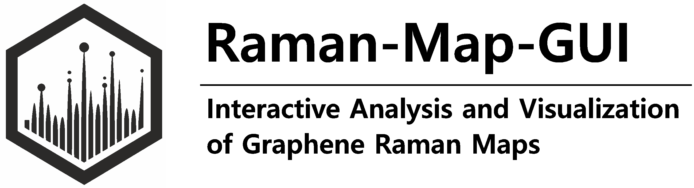

# **Raman-Map-GUI**: Interactive Analysis and Visualization of Graphene Raman Maps




 [](https://www.gnu.org/licenses/gpl-3.0)

This repository contains the source code and supporting resources for **Raman-Map-GUI**, an interactive software tool for the analysis of Raman spectra of graphene.

The application is designed to enable intuitive, reproducible, and quantitative analysis of Raman data, with a particular focus on the interactive visualization and analysis of graphene Raman peak parameters, without requiring any programming experience.

## ✨ Features

- **User-friendly graphical interface**  
  Automated fitting of Raman spectra with fully interactive analysis, requiring no prior coding knowledge.

- **Spatial mapping of Raman peak parameters**  
  All fitted peak parameters are visualized as two-dimensional $(x,y)$ maps, including region-of-interest (ROI) selection.

- **Correlation analysis**  
  Relationships between fitted quantities can be explored using interactive scatter plots.

- **Statistical analysis**  
  Distributions of fit results can be examined through histogram-based visualizations.

- **High-quality graphics export**  
  All plots can be exported as publication-ready `matplotlib` figures.

## 📘 Documentation

Comprehensive documentation, including theoretical background and usage examples, is available at [docs/index.md](docs/index.md).

## 📖 Citing Raman-Map-GUI

If you use our work in your research or find the code helpful, we would appreciate a citation:  

P. Schmidt, T. Ouaj, and C. Stampfer, "Raman-Map-GUI: Interactive Analysis and Visualization of Graphene Raman Maps" (2026). 

```bibtex
@misc{schmidt2026ramanmapgui,
  author       = {Schmidt, P. and Ouaj, T. and Stampfer, C.},
  title        = {Raman-Map-GUI: Interactive Analysis and Visualization of Graphene Raman Maps},
  year         = {2026},
  howpublished = {\url{https://github.com/ph-schmidt/Raman-Map-GUI}},
}
```


## 📚 Publications Using Raman-Map-GUI

The **Raman-Map-GUI** software has been used in the analysis of Raman spectroscopy data for graphene and related two-dimensional materials.

Examples of research using this analysis workflow include:

- **T. Ouaj et al.**,
  *Benchmarking the integration of hexagonal boron nitride crystals and thin films into graphene-based van der Waals heterostructures*  
  2D Materials 12, 015017 (2025)  
  [](https://doi.org/10.1088/2053-1583/ad96c9)

- **T. Ouaj et al.**,
  *Chemically detaching hBN crystals grown at atmospheric pressure and high temperature for high-performance graphene devices*  
  Nanotechnology 34 475703 (2023)  
  [](https://doi.org/10.1088/1361-6528/acf2a0)

  

- **O. J. Burton et al.**, *Putting High-Index Cu on the Map for High-Yield, Dry-Transferred CVD Graphene*  
  ACS Nano 17, 2, 1229–1238 (2023)  
  [](https://doi.org/10.1021/acsnano.2c09253)

*(This list will be updated as new publications using the software become available.)*


---

## 📬 Contact

If you encounter any issues or have questions about the project, feel free to open an issue on our GitHub repository.

## 🙏 Acknowledgements

We gratefully acknowledge the contributions of J. Sonntag, Z. Winter, M. Chlechowitz, C. Steiner, and B. Beschoten who supported the development and testing of this software.


## 🔗 Links

- 🎓 **2nd Institute of Physics A - RWTH Aachen University**  
  Research on quantum devices based on graphene and two-dimensional (2D) materials.  
  [🌐 institut2a.physik.rwth-aachen.de](https://institut2a.physik.rwth-aachen.de/)


