# Raman-Map-GUI – User Guide

## Table of Contents

- [Prepare Scan File](#prepare-scan-file)
  - [WITec Project FIVE](#witec-project-five)
- [Startup of the Interactive Analysis Software](#startup-of-the-interactive-analysis-software)
- [Load or Create Project](#load-or-create-project)
- [Fit Settings](#fit-settings)
- [Loading a Raman Scan File](#loading-a-raman-scan-file)
- [Analysis Widgets](#analysis-widgets)
  - [Map](#map)
  - [Spectrum](#spectrum)
  - [Scatter Plot](#scatter-plot)
  - [Histogram](#histogram)
- [Export](#export)
- [Color Gradient Editor](#color-gradient-editor)

## Prepare Scan File

To analyze Raman scan files, they must first be prepared according to the following rules.

### WITec Project FIVE

1. Right-click on the scan (**linescan** or **imagescan**) and select **Export → MATLAB**.
2. Choose the correct units:

   - `Space unit: µm`
   - `Spectral unit: rel. 1/cm`

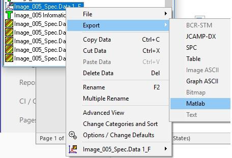 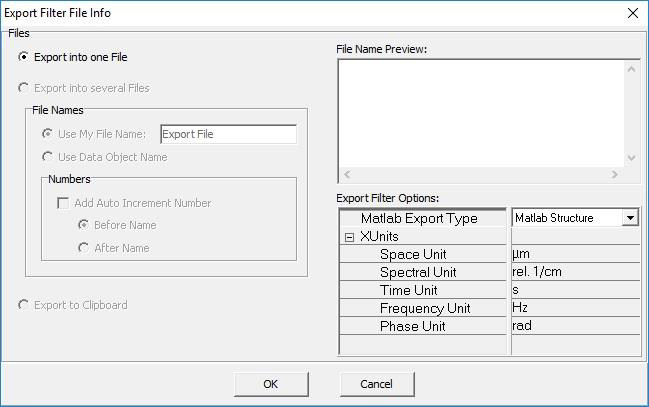


---

## Startup of the Interactive Analysis Software

After installation, the software can be conveniently started with:

```bash
uv run ramangui
```

You will see the main window:

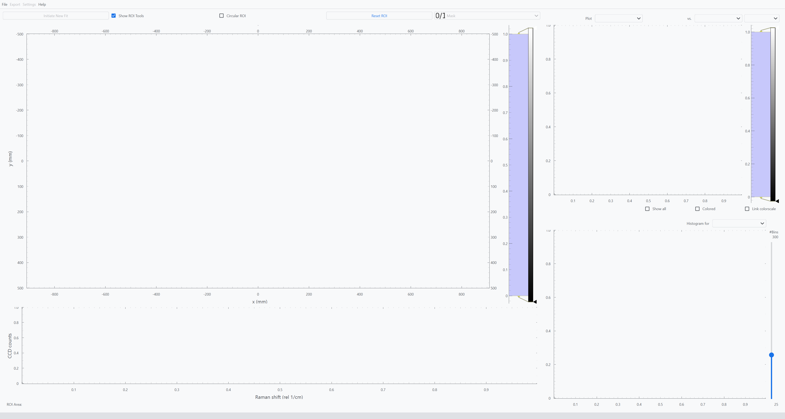


---

## Load or Create Project

After starting the program, you must load or create a project via  
**File → Open Project** or **File → New Project**.

During this process you will be asked to:

- select an existing **project folder**, or
- choose a location where a **new project folder** should be created.

Multiple Raman measurements can later be loaded into the same project.  
All measurements share the **same analysis settings**.

The project folder has the following structure:

```
Project Folder
├── Fits
│   └── (Contains exported data and graphics)
├── Maps
│   └── (Place raw scan data here)
└── Settings
    └── (Contains project settings)
```

---

## Fit Settings

The program includes a **default set of fit parameters** which should work in most cases.

If you need to modify the fit configuration, open:

**Settings → Fit Settings**

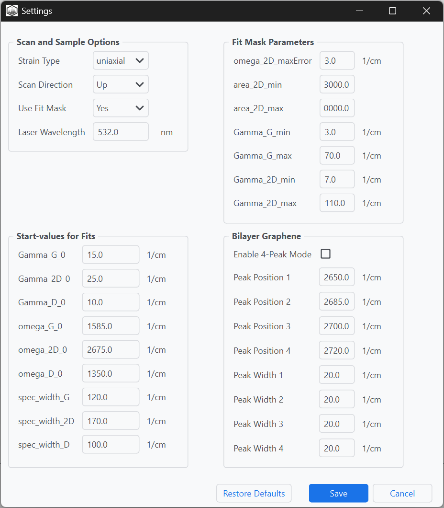

Below is a short description of the available settings.


### Scan and Sample Options

| Item | Options | Description |
|-----|-----|-----|
| **Strain Type** | `uniaxial`, `biaxial` | Defines the strain model used when calculating strain from Raman peak shifts. The selected model determines the strain calibration constant used for strain extraction. |
| **Scan Direction** | `Up`, `Down` | Defines the order in which the Raman map was recorded. This ensures that the reconstructed spatial map matches the acquisition direction. |
| **Use Fit Mask** | `Yes`, `No` | Enables or disables filtering of unreliable fit results using the mask parameters defined below. |
| **Laser Wavelength** | numeric value (nm) | Specifies the excitation wavelength of the Raman laser. This parameter is used for reference calibration and dispersion corrections. |


### Fit Mask Parameters

These parameters define criteria used to filter unreliable or non-physical fit results.

| Item | Description |
|-----|-----|
| **omega_2D_maxError** | Maximum allowed fitting error for the 2D peak position. Fits exceeding this error are rejected. |
| **area_2D_min** | Minimum allowed integrated intensity (area) of the 2D peak. Used to discard spectra with very weak graphene signal. |
| **area_2D_max** | Maximum allowed integrated intensity of the 2D peak. Can be used to exclude abnormal spectra or artifacts. |
| **Gamma_G_min** | Minimum allowed linewidth (FWHM) of the G peak. |
| **Gamma_G_max** | Maximum allowed linewidth (FWHM) of the G peak. |
| **Gamma_2D_min** | Minimum allowed linewidth (FWHM) of the 2D peak. |
| **Gamma_2D_max** | Maximum allowed linewidth (FWHM) of the 2D peak. |


### Start Values for Fits

These values are used as **initial parameters** for the nonlinear peak fitting routine.  
Providing reasonable starting values improves **fit stability and convergence**.

| Item | Description |
|-----|-----|
| **Gamma_G_0** | Initial linewidth estimate for the G peak |
| **Gamma_2D_0** | Initial linewidth estimate for the 2D peak |
| **Gamma_D_0** | Initial linewidth estimate for the D peak |
| **omega_G_0** | Initial peak position for the G mode |
| **omega_2D_0** | Initial peak position for the 2D mode |
| **omega_D_0** | Initial peak position for the D mode |
| **spec_width_G** | Spectral fitting window width around the G peak |
| **spec_width_2D** | Spectral fitting window width around the 2D peak |
| **spec_width_D** | Spectral fitting window width around the D peak |


### Bilayer Graphene

These settings are used when analyzing **bilayer graphene**, where the 2D peak can split into multiple components.

| Item | Options | Description |
|-----|-----|-----|
| **Enable 4-Peak Mode** | checkbox | Activates a four-component fit of the 2D peak characteristic of bilayer graphene |
| **Peak Position 1–4** | numeric values | Initial peak positions for the four components of the bilayer 2D band |
| **Peak Width 1–4** | numeric values | Initial linewidths of the four bilayer 2D peak components |

---

## Loading a Raman Scan File

To load a scan file:

1. Copy the scan file into the **Maps** folder inside the project directory.
2. Open the file via **File → Load Map**.

The Raman spectra will be **fitted automatically**, and the widgets in the main window will be populated with the results.

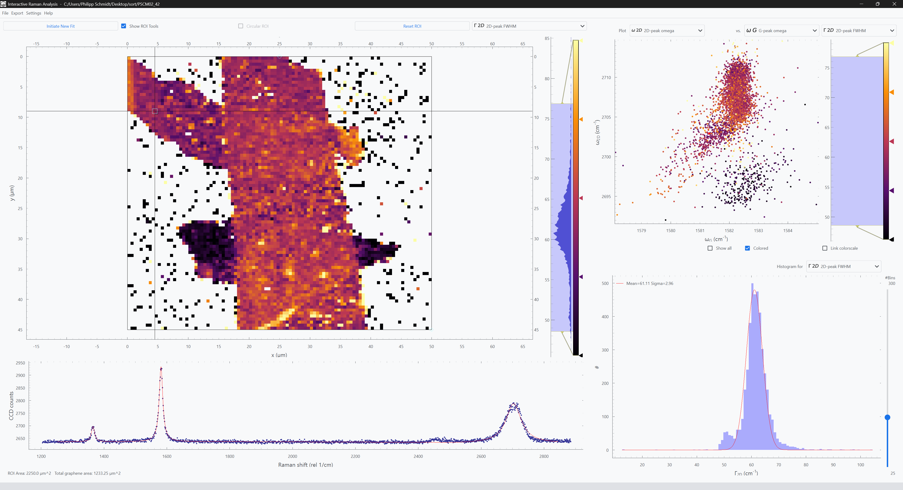

---

## Analysis Widgets

The following sections describe the widgets available in the main window.


## Map

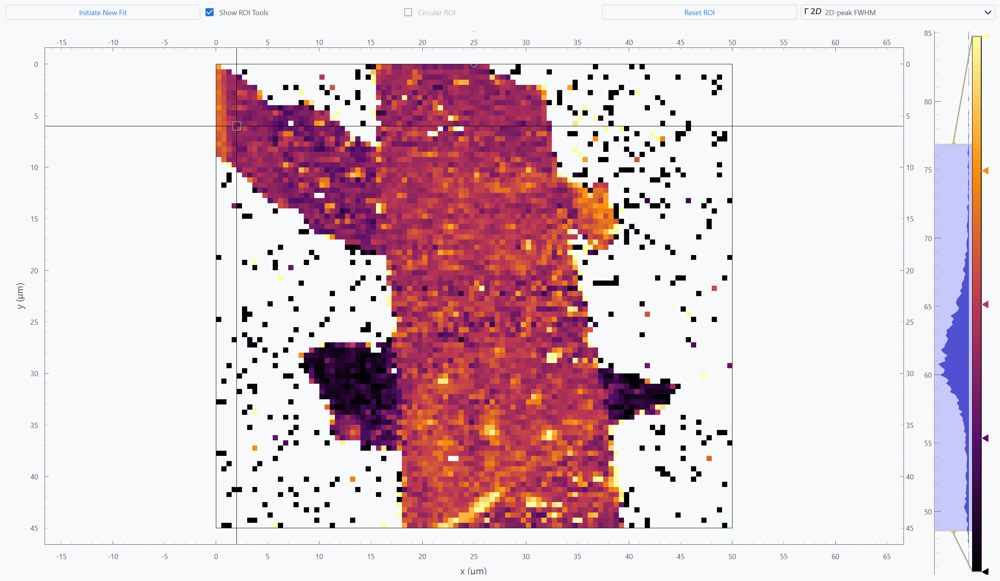

All fitted quantities are displayed in an **interactive heatmap-style plot**, allowing you to explore the spatial distribution of results.

### Toolbar (Top)

The **top row** of this widget provides several tools:

**Initiate New Fit**  
Re-runs the fitting procedure (useful after changing fit settings).

**Show ROI Tools**  
Shows or hides the **Region of Interest (ROI)** selector and the **crosshair tool**.

The ROI appears as a **black rectangle** and allows analysis to be restricted to a selected region.

**Reset ROI**  
Restores the ROI to cover the **entire dataset**.

**Fit Quantity**  
Dropdown menu used to select which **fitted quantity** is displayed.


## Color Tools (Right)

On the **right side of the widget**, several tools allow adjustment of the heatmap appearance.

**Colormap selection**  
Right-click the colorbar to choose a different colormap.

**Colormap adjustment**  
The **colored triangles** adjust how values are mapped to colors.

**Value range control**  
The **light-blue region** sets the minimum and maximum display range.


## Spectrum

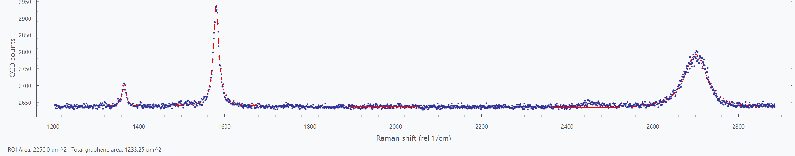

The **Spectrum** widget displays the **Raman spectrum** at the position selected with the **crosshair tool** in the map.

The **fitted result** is shown in **red**, allowing direct comparison with the measured spectrum.

The **lower section** indicates:

- **ROI area** — the currently selected Region of Interest
- **Detected graphene area** — the total region where graphene was identified


## Scatter Plot

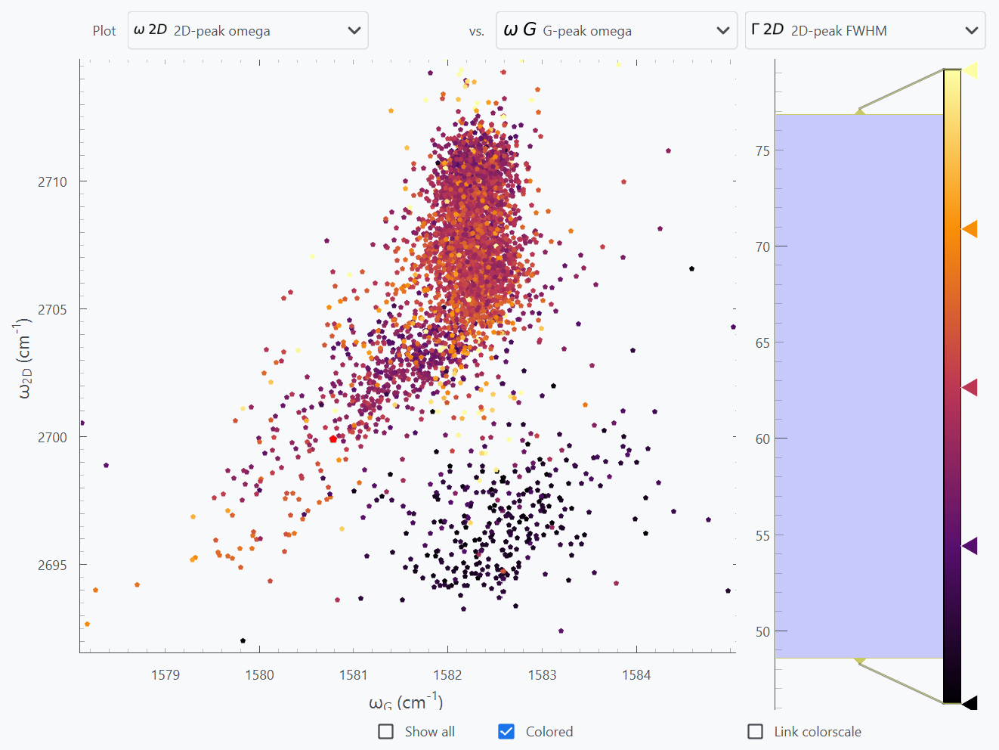

The **Scatter Plot** widget visualizes correlations between fitted quantities by plotting them against each other.

### Controls

The **top row** contains dropdown menus for selecting:

- **X quantity**
- **Y quantity**
- **Color quantity**

The **color quantity** determines the color of the datapoints.

As in the **Map widget**, the colormap and display range can be adjusted on the **right side**.

### Additional Options

**Show all**  
Displays the entire dataset in **gray**, in addition to datapoints inside the **ROI**.

**Colored**  
Enables or disables color mapping of datapoints.

**Link colorscale**  
Links the color scale to the **Map widget**, ensuring consistent visualization.


## Histogram

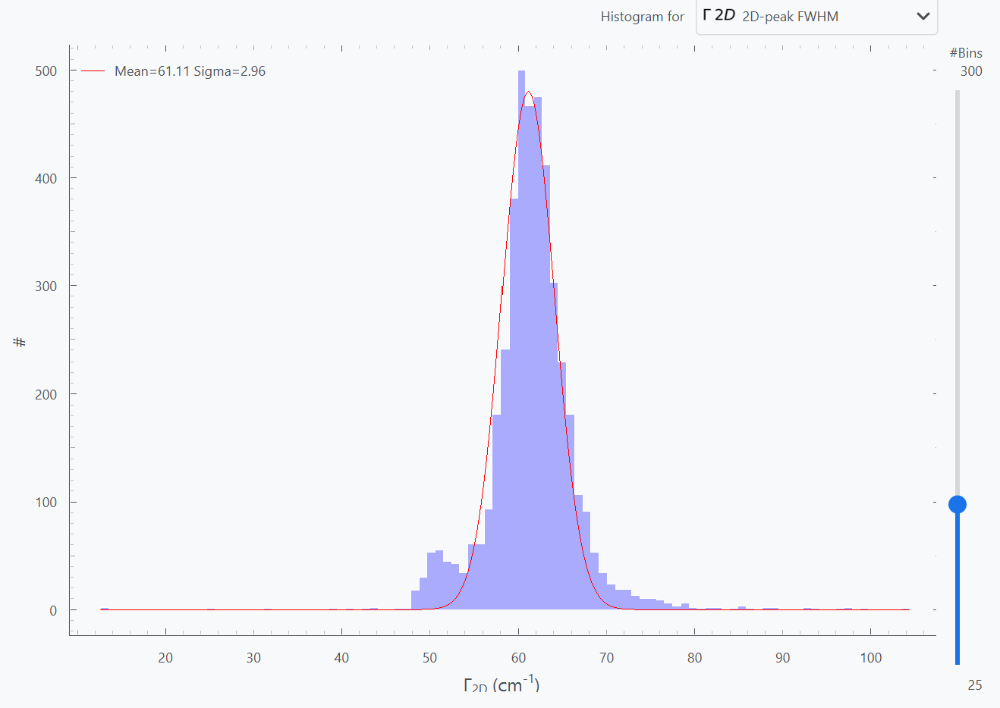

The **Histogram** widget shows the **distribution of a selected fitted quantity** within the current **ROI**.

### Controls

**Quantity selection**  
Select the quantity displayed in the histogram.

**Number of bins**  
The slider adjusts the number of bins used.

### Statistical Overlay

A **Gaussian curve** is displayed on top of the histogram, indicating:

- the **mean**
- the **standard deviation**

of the selected quantity within the ROI.

---

## Export

Analyzed data and plots can be exported for further processing.

### Export All

Use:

**Export → Export All**

This exports:

- all plots as **SVG** and **PNG**
- all processed data as **ASCII files**

This is the recommended option for exporting the **complete analysis result**.


### Export Dialog

For more control over export options, open:

**Export → Export Dialog**

Here you can configure the export settings.

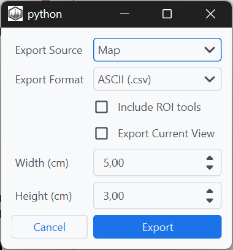

---

## Color Gradient Editor

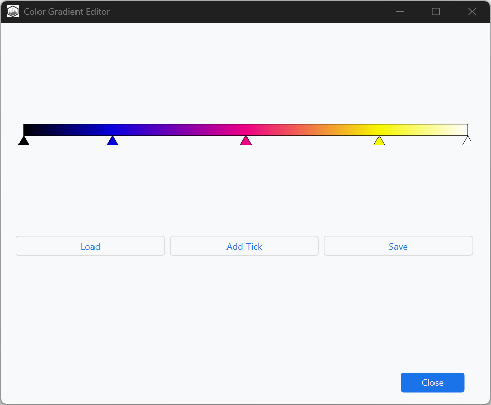

To customize colormaps, open:

**Settings → Color Gradient Settings**

The editor allows you to:

- **Modify the colormap** by **right-clicking** on the gradient
- **Add ticks** using the **Add Tick** button
- **Save** customized colormaps
- **Load** previously saved colormaps